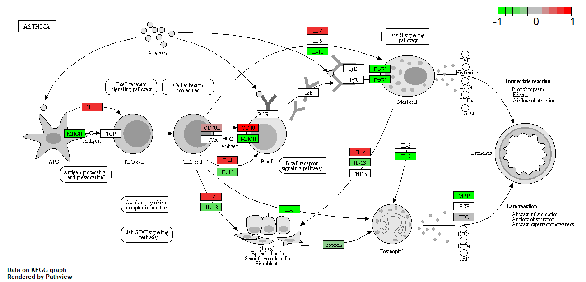

#Import countData and colData

```{r}
counts <- read.csv("airway_scaledcounts.csv", row.names = 1)
metadata <- read.csv("airway_metadata.csv")
```

```{r}
head(counts)
dim(counts)
head(metadata)
```

#Q1. How many genes are in this dataset? 38694 genes

#Q2. How many 'control' cell lines do we have? 4 control cell lines

#Mean counts per gene; method 1

```{r}
control <- metadata[metadata[,"dex"]=="control",]
control.counts <- counts[ ,control$id]
control.mean <- rowSums( control.counts )/4 
head(control.mean)
```

#Method 2

```{r}
library(dplyr)
control <- metadata %>% filter(dex=="control")
control.counts <- counts %>% select(control$id) 
control.mean <- rowSums(control.counts)/4
head(control.mean)
```

#Q3. How would you make the above code in either approach more robust? Create a function

#Q4. Follow the same procedure for the treated samples?

```{r}
treated <- metadata %>% filter(dex=="treated")
treated.counts <- counts %>% select(treated$id)
treated.mean <- rowSums(treated.counts)/4
head(treated.mean)
```

#Combined meancount data

```{r}
meancounts <- data.frame(control.mean, treated.mean)
```

#Q5a. Create a scatter plot showing the mean of the treated samples against the mean of the control samples.

```{r}
plot(meancounts, xlab = "Control", ylab = "Treated")
```

#Q5b. You could also use the ggplot2 package to make this figure producing the plot below. What geom function would you use? #geom_point()

#Q6. Try plotting both axes on a log scale. What is the argument to plot() that allows you to do this?

```{r}
plot(meancounts, xlab = "Control", ylab = "Treated", log = "xy")
```

#Calculate the log2 fold change

```{r}
meancounts$log2fc <- log2(meancounts[,"treated.mean"]/meancounts[,"control.mean"])
head(meancounts)
```

#Filter out zero values

```{r}
zero.vals <- which(meancounts[,1:2]==0, arr.ind=TRUE)

to.rm <- unique(zero.vals[,1])
mycounts <- meancounts[-to.rm,]
head(mycounts)
```

#Q7. What is the purpose of the arr.ind arguement in the which() function call above? Why would we then take the first column of the output and need to call the unique() function? #?w hich() #?u nique()

arr.ind returns row and column indices that are zero values. As zero values are in columns, we want to purposely exclude these values with the unique function.

#Filter by log2 values

```{r}
up.ind <- mycounts$log2fc > 2
down.ind <- mycounts$log2fc < (-2)
```

#Q8. Using the up.ind vector can you determine how many upregulated genes that are greater than 2 fc? There are 250 genes that are upregulated.

```{r}
sum(up.ind, na.rm = TRUE)
table(up.ind)['TRUE']
```

#Q9. Using the down.ind vector can you determine how many downregulated genes that are greater than 2 fc? There are 367 genes that are downregulated.

```{r}
sum(down.ind, na.rm = TRUE)
```

#Q10. Do you trust these results? Why or why not? These results don't tell us whether the fold changes are statistically significant, so further analysis is required.

#DESeq2 normalization

```{r}
library(DESeq2)
citation("DESeq2")
```

#DESeqDataSet

```{r}
dds <- DESeqDataSetFromMatrix(countData=counts, 
                              colData=metadata, 
                              design=~dex)
dds

dds <- DESeq(dds)

res <- results(dds)
res

res <- as.data.frame(res)
View(res)
summary(res)

res05 <- results(dds, alpha=0.05)
summary(res05)
```

#Add annotation data

```{r}
library("AnnotationDbi")
library("org.Hs.eg.db")
#help("REFSEQ")
```

#Add individual columns to results

```{r}
res$symbol <- mapIds(org.Hs.eg.db,
                     keys=row.names(res),
                     keytype = "ENSEMBL",
                     column="SYMBOL",
                     multiVals = "first")
head(res)
```

#Q11. Run the mapIds() function two more times to add the Entrez ID and UniProt accession and GENENAME as new columns called res$entrez, res$uniprot, res\$genename.

```{r}
res$entrez <- mapIds(org.Hs.eg.db,
                     keys=row.names(res),
                     keytype = "ENSEMBL",
                     column="ENTREZID",
                     multiVals = "first")

res$uniprot <- mapIds(org.Hs.eg.db,
                     keys=row.names(res),
                     keytype = "ENSEMBL",
                     column="UNIPROT",
                     multiVals = "first")

res$genename <- mapIds(org.Hs.eg.db,
                     keys=row.names(res),
                     keytype = "ENSEMBL",
                     column="GENENAME",
                     multiVals = "first")

head(res)
```

#Arrange the list by p adj

```{r}
ord <- order( res$padj )
View(res[ord,])
head(res[ord,])
```

#Create csv file with ordered annotations

```{r}
write.csv(res[ord,], "deseq_results.csv")
```

#Volcano plots

```{r}
plot( res$log2FoldChange,  -log(res$padj), 
      xlab="Log2(FoldChange)",
      ylab="-Log(P-value)")

#Add lines
abline(v=c(-2,2), col="darkgray", lty=2)
abline(h=-log(0.05), col="darkgray", lty=2)

#Custom point color vector
mycols <- rep("gray", nrow(res))
mycols[ abs(res$log2FoldChange) > 2 ]  <- "red" 

inds <- (res$padj < 0.01) & (abs(res$log2FoldChange) > 2 )
mycols[ inds ] <- "blue"
```

#Finalized plot

```{r}
plot( res$log2FoldChange,  -log(res$padj), 
      col=mycols, ylab="-Log(P-value)", xlab="Log2(FoldChange)" )
abline(v=c(-2,2), col="gray", lty=2)
abline(h=-log(0.1), col="gray", lty=2)
```

#Enhanced volcano plot package

```{r}
library(EnhancedVolcano)

x <- as.data.frame(res)

EnhancedVolcano(x,
                lab = x$symbol,
                x = 'log2FoldChange',
                y = 'pvalue')
```

#Pathway analysis

```{r}
library(pathview)
library(gage)
library(gageData)

data(kegg.sets.hs)
```

#Examine the first 2 pathways in the human kegg set

```{r}
head(kegg.sets.hs, 2)

#Vector of fold changes
foldchanges = res$log2FoldChange
names(foldchanges) = res$entrez
head(foldchanges)

keggres = gage(foldchanges, gsets=kegg.sets.hs)
attributes(keggres)

```

#First 3 down reg pathways

```{r}
head(keggres$less, 3)

#Pathview
pathview(gene.data=foldchanges, pathway.id="hsa05310")
pathview(gene.data=foldchanges, pathway.id="hsa05310", kegg.native=FALSE)
```

 

#Q12. Can you do the same procedure as above to plot the pathview figures for the top 2 down-regulated pathways?

```{r}
head(keggres$greater, 2)
pathview(gene.data=foldchanges, pathway.id="hsa00500")
pathview(gene.data=foldchanges, pathway.id="hsa00330")
```

 

