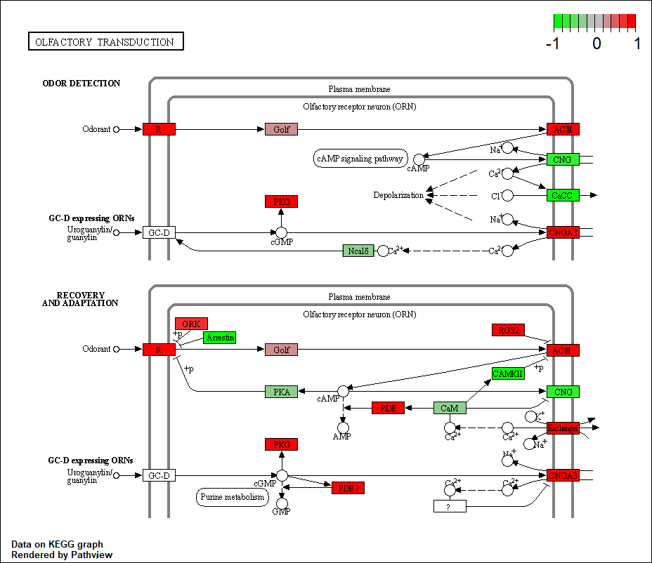

# Differential Expression Analysis

Data initialization

```{r}
library(DESeq2)

metaFile <- "GSE37704_metadata.csv"
countFile <- "GSE37704_featurecounts.csv"

#Import metadata & counts
colData = read.csv(metaFile, row.names=1)
head(colData)

countData = read.csv(countFile, row.names=1)
head(countData)
```

Q1: Removal of length column

```{r}
countData <- as.matrix(countData[,-1])
head(countData)
```

Q2: Removal of zero values

```{r}
countData = countData[rowSums(countData[])>0, ]
head(countData)
```

Running DESeq2

```{r}
dds = DESeqDataSetFromMatrix(countData=countData,
                             colData=colData,
                             design=~condition)
dds = DESeq(dds)

dds
```

HoxA1 results

```{r}
res = results(dds, contrast=c("condition", "hoxa1_kd", "control_sirna"))
#res
```

Q3: Call the summary() function on your results to get a sense of how many genes are up or down-regulated at the default 0.1 p-value cutoff.

```{r}
summary(res)
```

Volcano plots

```{r}
plot( res$log2FoldChange, -log(res$padj) )
```

Q4: Adds color and axis labels

```{r}
# Make a color vector for all genes
mycols <- rep("gray", nrow(res) )

# Color red the genes with absolute fold change above 2
mycols[ abs(res$log2FoldChange) > 2 ] <- "red"

# Color blue those with adjusted p-value less than 0.01
#  and absolute fold change more than 2
inds <- (res$padj < 0.01) & (abs(res$log2FoldChange) > 2 )
mycols[ inds ] <- "blue"

plot( res$log2FoldChange, -log(res$padj), col=mycols, xlab="Log2(FoldChange)", ylab="-Log(P-value)" )
```

Q5. SYMBOL, ENTREZID and GENENAME annotation

```{r}
library("AnnotationDbi")
library("org.Hs.eg.db")

columns(org.Hs.eg.db)

res$symbol = mapIds(org.Hs.eg.db,
                    keys=row.names(res), 
                    keytype="ENSEMBL",
                    column="SYMBOL",
                    multiVals="first")

res$entrez = mapIds(org.Hs.eg.db,
                    keys=row.names(res),
                    keytype="ENSEMBL",
                    column="ENTREZID",
                    multiVals="first")

res$name =   mapIds(org.Hs.eg.db,
                    keys=row.names(res),
                    keytype="ENSEMBL",
                    column="GENENAME",
                    multiVals="first")

head(res, 10)
```

Q6: Reorder these results by adjusted p-value and save them to a CSV file in your current project directory

```{r}
res = res[order(res$pvalue),]
write.csv(res, file="deseq_results.csv")
```

# Pathway analysis

Load packages and data

```{r}
library(pathview)
library(gage)
library(gageData)

data("kegg.sets.hs")
data("sigmet.idx.hs")
```

Signaling and metabolic pathways only

```{r}
kegg.sets.hs = kegg.sets.hs[sigmet.idx.hs]
head(kegg.sets.hs, 3)
```

Vector of fold changes

```{r}
foldchanges = res$log2FoldChange
names(foldchanges) = res$entrez
head(foldchanges)
```

gage pathway analysis

```{r}
keggres = gage(foldchanges, gsets=kegg.sets.hs)
attributes(keggres)
```

Down regulated pathways

```{r}
head(keggres$less)
```

Pathview analysis

```{r}
pathview(gene.data=foldchanges, pathway.id="hsa04110")
```


Top 5 up regulated pathways

```{r}
head(keggres$greater)
keggrespathways <- rownames(keggres$greater)[1:5]

# Extract the 8 character long IDs part of each string
keggresids = substr(keggrespathways, start=1, stop=8)
keggresids

# Pass into pathview
pathview(gene.data=foldchanges, pathway.id=keggresids, species="hsa")
pathview(gene.data=foldchanges, pathway.id="hsa04740")
```




Q7: Top 5 down regulated pathways

```{r}
keggrespathways <- rownames(keggres$less)[1:5]

# Extract the 8 character long IDs part of each string
keggresids = substr(keggrespathways, start=1, stop=8)
keggresids

# Pass into pathview
pathview(gene.data=foldchanges, pathway.id=keggresids, species="hsa")
```

    

# Gene Ontology

```{r}
data(go.sets.hs)
data(go.subs.hs)

# Focus on Biological Process subset of GO
gobpsets = go.sets.hs[go.subs.hs$BP]

gobpres = gage(foldchanges, gsets=gobpsets, same.dir=TRUE)

lapply(gobpres, head)
```

# Reactome analysis

Significant genes

```{r}
sig_genes <- res[res$padj <= 0.05 & !is.na(res$padj), "symbol"]
print(paste("Total number of significant genes:", length(sig_genes)))

write.table(sig_genes, file="significant_genes.txt", row.names=FALSE, col.names=FALSE, quote=FALSE)
```

Q8. What pathway has the most significant "Entities p-value"? Do the most significant pathways listed match your previous KEGG results? What factors could cause differences between the two methods?

The endosomal/vacuolar pathway has the most significant entities p value: 1.66 E-4.
These results differ from the KEGG results as many of the most significant results pertain to the cell cycle and their associated phases and checkpoints. As mentioned in the lab, there are differences in the frequency these databases are updated and so results may not align if databases are not current.